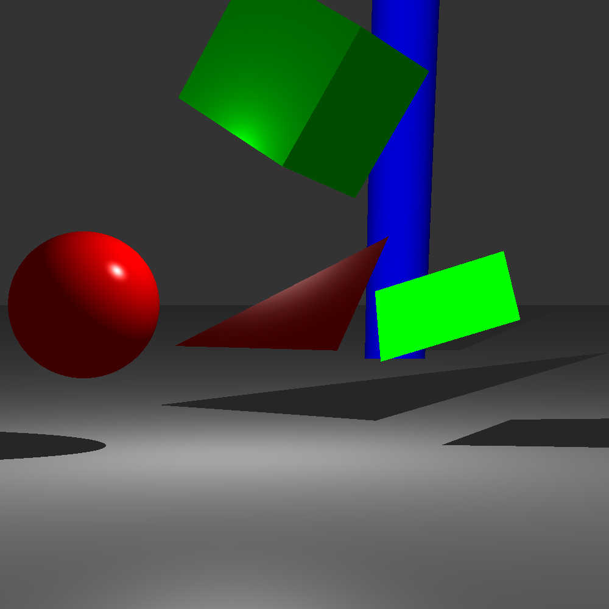

## Purpose

This application is an image generator using raytracing. It has been written in CPP and has some parameters that you can change. This is a command-line application.

## Commands
The command line can take 6 different arguments :
- `-s/--scene` : A string, the name of the scene to be loaded.
- `-h/--height` : An int, the height of the image to create.
- `-w/--width` : An int, the width of the image to create.
- `-o/--output` : A string, the name of the image to create.
- `-d/--shadows` : A boolean, enable the shadows
- `-x/--checkboard` : A boolean, enable checkboard material

Every argument is **optional** and will be defaulted if not written by the user.
For more information, the help command can be run with `-e/--help`.

The format for the scene to be loaded is as follows :
- object : material x y z xRotation yRotation zRotation scale
- material : name r g b r g b r g b shininess
- light : x y z rDiffuse gDiffuse bDiffuse rSpecular gSpecular bSpecular

Some images output have been generated too.

## Input file example

```
Material mat1 1 0 0 0.8 0 0 1 1 1 50
Material mat2 0 1 0 0 1 0 0 1 0 30
Material mat3 0 0 1 0 0 1 0 0 1 45
Material whiteMat 0.5 0.5 0.5 0.5 0.5 0.5 0.5 0.5 0.5 50
Light -1 2 -1 1 1 1 1 1 1
Sphere mat1 -3 0 0 0 0 0 1
Cube mat2 0 3 0 45 45 45 1
Cylinder mat3 3 62 0 25 25 0 5
Triangle mat1 -2 2 1 60 45 0 2
Carre mat2 2 0 1 -60 -20 0 1
Plan whiteMat 0 -2 0 -90 0 0 1
```

## Output files examples



